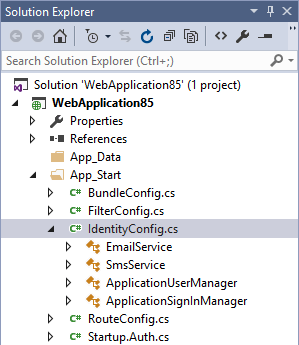
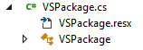
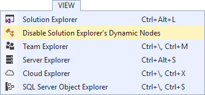
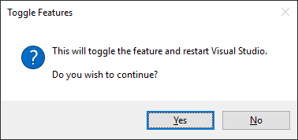
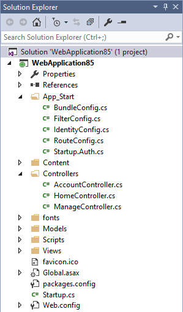

# Disable Solution Navigator Class View

Download the extension at the
[VS Gallery](https://visualstudiogallery.msdn.microsoft.com/62461a72-4255-4eac-a630-52758e9c3723)
or get the
[nightly build](http://vsixgallery.com/extension/4ce74140-3f68-4438-92a4-a54afea98179/).

---------------------------------------------------

A single-purpose extension that makes it easy to
disable/enable Solution Explorer's inline Class View
nodes from C# and VB files. 

## Inline class view
Solution Explorer injects extra virtual nodes under certain
code files to give a sneak peek inside them. 

  

Though it provides more information about a file, it also
adds complexity to the Solution Explorer that may confuse
more than help.

## File nesting
One of the issues with in inline class view is that it
makes it more difficult to find nested files.

When files are nested under C# files, it is impossible
to tell since it looks like any other C# file with the
expander icon next to it.

 

It's only when the file is expanded that the nested file
becomes visible.

  

In this example the file _VSPackage.resx_ is nested under
the C# file _VSPackage.cs_ but it's only visible when
the file is expanded.

## Hide inline class view
Under the top-level **View** menu, a new button is added
to toggle the visibility of the inline class view.

  

Clicking the button will prompt the user with a question
to proceed and restart Visual Studio.

Clicking **Yes** will toggle the inline class view feature
on/off and restart VS. 

The result is a much cleaner Solution Explorer.

  

## License

[Apache 2.0](LICENSE)